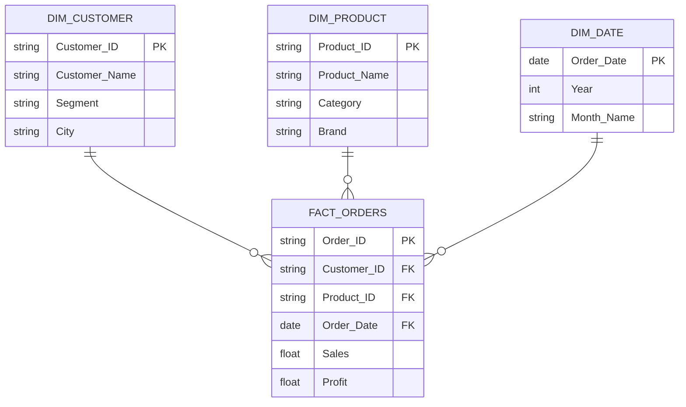

# 📊 Flipkart — Customer Orders & Product Sales Analytics Dashboard

An end-to-end **sales analytics project** built on a star-schema data model, analyzing Flipkart-style e-commerce transactions — covering customer behavior, product performance, sales trends, profitability, and delivery efficiency.

Includes the **source dataset (Excel)**, a **star-schema data model**, and is ready to plug into **Power BI / Excel** for dashboard building.

---

## 📌 Overview

| | |
|---|---|
| **Domain** | E-Commerce (Flipkart) |
| **Model Type** | Star Schema (1 Fact + 3 Dimensions) |
| **Source File** | `Flipkart Data Records.xlsx` |
| **Fact Table Rows** | ~5,000 order line items |
| **Customers** | ~1,200 |
| **Products** | ~450 |
| **Date Range Coverage** | `Dim Date` — day-level calendar table |
| **Tools** | Excel / Power BI |

---

## 🗂️ Project Structure

```Flipkart — Customer Orders & Product Sales Analytics Dashboard/
│
├── README.md                          # Project documentation (this file)
│
├── data/
│   └── Flipkart Data Records.xlsx     # Source workbook (4 sheets: Fact + 3 Dims)
│
├── model/
│   └── Data Model.png                 # Star-schema ER diagram (Mermaid)
│
├── dashboard/
│   └── Flipkart.pbix                  # Power BI dashboard file (add after building)
│
└── docs/
    └── screenshots/                   # Dashboard preview images (optional)
```

---

## 🧩 Data Model (Star Schema)



 **star schema** — one central fact table (`Fact Orders`) surrounded by three dimension tables (`Dim Customer`, `Dim Product`, `Dim Date`), enabling fast, flexible slicing of sales data by customer, product, and time.

---

## 🗃️ Table Details

<details>
<summary><b>🟦 Fact Orders</b> — order-line level transactions (~5,000 rows)</summary>

| Column | Description |
|---|---|
| `Order ID` | Unique order identifier |
| `Customer ID` | FK → Dim Customer |
| `Product ID` | FK → Dim Product |
| `Order Date` | FK → Dim Date |
| `Ship Date` | Date the item was shipped |
| `Ship Mode` | Standard / Scheduled / Express, etc. |
| `Quantity` | Units ordered |
| `Unit Price (INR)` | Price per unit |
| `Discount (%)` | Discount applied |
| `Sales (INR)` | Net sales value |
| `Profit (INR)` | Profit earned on the line item |
| `Payment Mode` | UPI / Card / COD / Net Banking, etc. |
| `Delivery Status` | Delivered / Shipped / Cancelled, etc. |

</details>

<details>
<summary><b>🟩 Dim Customer</b> — customer master (~1,200 rows)</summary>

| Column | Description |
|---|---|
| `Customer ID` | Primary key |
| `Customer Name` | Full name |
| `Gender` | Male / Female |
| `Email`, `Phone` | Contact details |
| `Segment` | Consumer / Corporate / Home Office |
| `Membership Type` | Regular / Premium, etc. |
| `Country`, `City`, `State`, `Zone` | Geography |
| `Pincode` | Postal code |
| `Signup Date` | Date the customer registered |

</details>

<details>
<summary><b>🟨 Dim Product</b> — product master (~450 rows)</summary>

| Column | Description |
|---|---|
| `Product ID` | Primary key |
| `Product Name` | Product title |
| `Category` | e.g. Electronics, Beauty & Personal Care |
| `Sub-Category` | e.g. Skincare, Fiction |
| `Brand` | Product brand |
| `MRP (INR)` | Maximum retail price |
| `Rating` | Average product rating |

</details>

<details>
<summary><b>🟧 Dim Date</b> — calendar table (~1,340 rows)</summary>

| Column | Description |
|---|---|
| `Order Date` | Primary key (date) |
| `Year`, `Quarter`, `Month`, `Month Name` | Time hierarchy |
| `Date` | Day of month |
| `Day` | Day name (Sunday, Monday...) |
| `Day Type` | Weekday / Weekend |

</details>

---

## 🎯 Business Questions This Model Answers

- 📈 What are the monthly/ yearly sales & profit trends?
- 🏆 Which product categories and brands drive the most revenue and profit?
- 👥 Who are the top customers by spend, segment, or city/zone?
- 💳 Which payment mode is most preferred, and does it affect order value?
- 🚚 What's the delivery performance (on-time vs delayed vs cancelled)?
- 🛍️ How does discounting impact sales volume vs profit margin?
- 📅 Are weekday vs weekend sales patterns different?
- 🌍 Which regions (Zone/State/City) contribute the most revenue?

---

## ⚙️ How to Use

1. **Clone the repository**
   ```bash
   git clone https://github.com/nithish-0706/Flipkart-Analytics-Dashboard.git
   cd flipkart-sales-analytics-dashboard
   ```

2. **Open `data/Flipkart_Data_Records.xlsx`** — it contains 4 ready-to-use sheets: `Fact Orders`, `Dim Customer`, `Dim Product`, `Dim Date`.

3. **Load into Power BI /**
   - Import all 4 sheets as separate tables.
   - Create relationships per the star schema above:
     - `Fact Orders[Customer ID]` → `Dim Customer[Customer ID]`
     - `Fact Orders[Product ID]` → `Dim Product[Product ID]`
     - `Fact Orders[Order Date]` → `Dim Date[Order Date]`

4. **Build the dashboard** — suggested pages:
   - **Sales Overview** — KPIs (Total Sales, Profit, Orders, AOV), trend line by month
   - **Customer Insights** — top customers, segment split, geography map
   - **Product Performance** — category/brand ranking, top-rated products
   - **Delivery & Payments** — delivery status funnel, payment mode split

---

## 📐 Key Metrics / DAX Ideas (Power BI)

```dax
Total Sales = SUM('Fact Orders'[Sales (INR)])
Total Profit = SUM('Fact Orders'[Profit (INR)])
Profit Margin % = DIVIDE([Total Profit], [Total Sales], 0)
Total Orders = DISTINCTCOUNT('Fact Orders'[Order ID])
Average Order Value = DIVIDE([Total Sales], [Total Orders], 0)
YoY Sales Growth % =
    VAR CurrentYearSales = [Total Sales]
    VAR PreviousYearSales = CALCULATE([Total Sales], SAMEPERIODLASTYEAR('Dim Date'[Order Date]))
    RETURN DIVIDE(CurrentYearSales - PreviousYearSales, PreviousYearSales, 0)
```

---

## 🛠️ Tech Stack

- **Data Source:** Excel (`.xlsx`)
- **Modeling:** Star schema (Fact + Dimension tables)
- **Visualization:** Power BI / Tableau / Excel PivotTables & Charts
- **Diagramming:** Mermaid.js (ER diagram)

---

## 🚀 Future Enhancements

- [ ] Add `Dim Location` for deeper geo-analysis (map visuals)
- [ ] Add RFM (Recency, Frequency, Monetary) customer segmentation
- [ ] Add a returns/refunds fact table for churn & loss analysis
- [ ] Publish live dashboard to Power BI Service and embed link here
- [ ] Automate data refresh via Power Query / scheduled ETL

---

## 👤 Author

**Name : Nithish**
📧 nithishjrp@gmail.com · 🔗 [LinkedIn](https://www.linkedin.com/in/nithish-jrp/) · 💻 [GitHub](https://github.com/nithish-0706)

---

## 📄 License

This project is open-sourced under the [MIT License](LICENSE).
